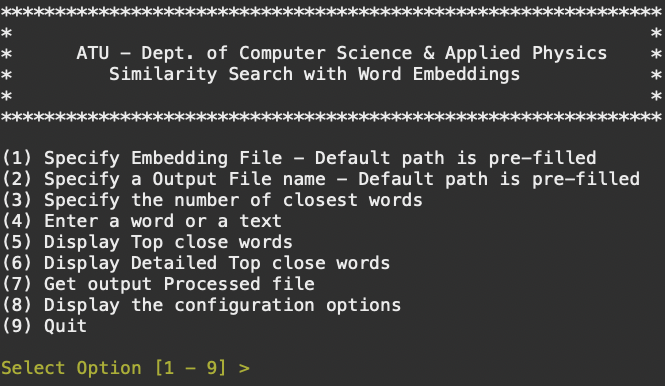
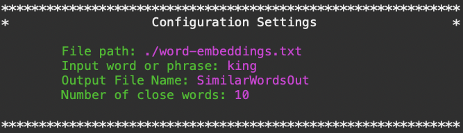
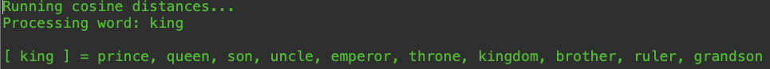
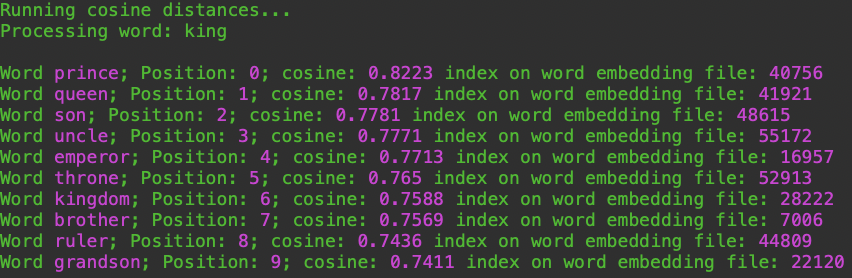

# Word Embeddings: A Java Application

Welcome to my first Java application! This project was developed as part of the H.Dip in Science (Software Development) course, specifically for the Object-Oriented Software Development module. The application demonstrates various OOP principles, including encapsulation, abstraction, and modularity.

## Overview

Key features include:
- Reading and processing large text files
- Analyzing word embeddings to calculate cosine similarity
- Interacting with a user-friendly console menu

## Features

1. **Configuration**: Manages application settings with encapsulated attributes.
2. **ConsoleColour**: Provides utility methods for colorful console output.
3. **CosineDistance**: Calculates cosine similarity between vectors.
4. **EmbeddingAnalyzer**: Analyzes word embeddings to find similar words.
5. **FileReaderUtility**: Reads content from text files.
6. **Menu**: Displays a user menu and captures user input.
7. **Runner**: The entry point of the application, demonstrating the use of other classes.
8. **Sort**: Provides methods to sort arrays.

## Word Embeddings and Cosine Similarity

### Word Embeddings

Word embeddings are a type of word representation that allows words with similar meaning to have a similar representation. This is typically achieved by representing words as vectors in a continuous vector space where semantically similar words are close together. In this application, word embeddings are used to analyze and find similar words based on their vector representations.

For demonstration purposes, there is an example file with 59,602 words. Each word in the embeddings file has 50 features (numbers) associated with it.

### Cosine Similarity

Cosine similarity is a measure of similarity between two non-zero vectors. It is calculated as the cosine of the angle between the two vectors. The cosine similarity value ranges from -1 to 1, where 1 indicates that the vectors are identical, 0 indicates orthogonality (no similarity), and -1 indicates complete dissimilarity.

In this application, cosine similarity is used to determine the similarity between word embeddings. By calculating the cosine similarity between vectors, we can find words that are closest in meaning to a given word.

## Getting Started

### Prerequisites

To run this application, you need to have Java installed on your system.

### Installation

1. Clone the repository from GitHub:

   ```sh
   git clone https://github.com/AdrianoGandini/WordEmbedding.git
   ```

2. Navigate to the project directory:

   ```sh
   cd WordEmbedding
   ```

3. Compile the Java files:

   ```sh
   javac *.java
   ```

4. Run the application:

   ```sh
   java Runner
   ```

## Usage

When you run the application, it will:
1. Display configuration settings.
2. Read and print the contents of an example text file.
3. Show a menu with options for the user to select.
4. Perform tasks based on user input, such as sorting arrays or analyzing embeddings.

## Screenshots

### Main Menu
The main menu of the application allows you to specify various settings and perform different actions.



### Configuration Settings
You can configure the file paths, input word, output file name, and the number of closest words to find.



### Display Top Close Words
Displays the top close words based on cosine similarity.



### Display Detailed Top Close Words
Provides a detailed view of the top close words including their cosine similarity values and positions in the embedding file.



## Future Challenges

Here are a few ideas for future challenges:
1. **Extend the EmbeddingAnalyzer**: Add more functionalities to the EmbeddingAnalyzer, such as supporting different similarity metrics or visualizing the embeddings.
2. **Improve Error Handling**: Enhance the application’s robustness by implementing comprehensive error handling and logging.
3. **User Interface**: Develop a graphical user interface (GUI) to make the application more user-friendly.
4. **Performance Optimization**: Optimize the code for better performance, especially when dealing with large embedding files.

## Acknowledgements

This project was developed as part of the H.Dip in Science (Software Development) - Object-Oriented Software Development module. 

## Contributing

Feel free to fork this repository and make your own contributions. Pull requests are welcome!

## License

This project is licensed under the MIT License.

---

Thank you for checking out my project! If you have any questions or feedback, please feel free to contact me.

